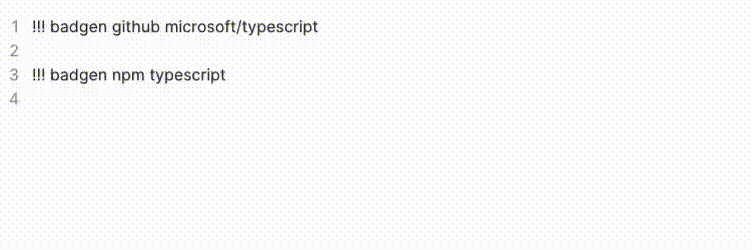

# Obsidian Badgen

A [shields badgen](https://shields.io/) plugin for [Obsidian](https://obsidian.md/).

## Examples



## Usage

```
!!! badgen github :user/:repo
!!! badgen docker :library
!!! badgen docker :user/:library
!!! badgen npm :package
!!! badgen npm :scope/:package
```

## Custom build

build with `yarn`:

```bash
foo@bar:~/obsidian-badgen$ yarn install
foo@bar:~/obsidian-badgen$ yarn build
```

or build with `npm`:

```bash
foo@bar:~/obsidian-badgen$ npm install
foo@bar:~/obsidian-badgen$ npm run build
```

then, copy `dist/*` to your vault:

```bash
foo@bar:~/obsidian-badgen$ mkdir -p ${your_vault_path}/.obsidian/plugins/obsidian-badgen/
foo@bar:~/obsidian-badgen$ copy dist/* ${your_vault_path}/.obsidian/plugins/obsidian-badgen/
```

finally, enable the plugin `Obsidian Badgen`.

## Maintainers

[@hypc](https://github.com/hypc)

## License

[MIT](https://github.com/hypc/obsidian-badgen/blob/master/LICENSE) © hypc
